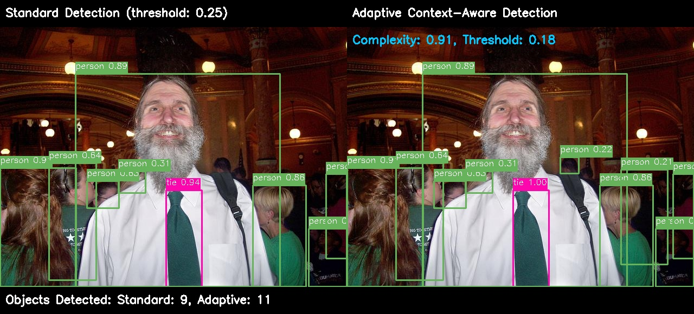

# AdaptiVision: Adaptive Context-Aware Object Detection

AdaptiVision is an innovative object detection system that introduces adaptive confidence thresholding techniques to significantly improve detection quality across diverse scenes. By dynamically adjusting detection thresholds based on scene complexity and context, AdaptiVision achieves superior performance compared to traditional fixed-threshold approaches.

<p align="center">
  
  <br>
  <em>Left: Standard Detection (fixed threshold: 0.25), Right: AdaptiVision (adaptive threshold: 0.18)</em>
</p>

## Key Features

- **Adaptive Confidence Thresholding**: Automatically adjusts detection thresholds based on scene complexity
- **Scene Complexity Analysis**: Evaluates scenes based on object count, size variance, and density
- **Context-Aware Reasoning**: Uses object relationships to boost confidence of related objects
- **Class-Specific Adjustments**: Applies tailored threshold modifications for different object classes
- **Cross-Platform Support**: Compatible with Windows, macOS (including Apple Silicon), and Linux
- **Rich Visualizations**: Provides detailed visualizations of threshold adaptations and detection results

## Performance Highlights

- **Optimal detection across diverse scenes**: Maintains quality in both simple and complex environments
- **Reduced false positives**: Higher thresholds in simple scenes filter out low-quality detections
- **Improved detection in complex scenes**: Lower thresholds help recover valid objects
- **Minimal computational overhead**: Only 4-7ms additional processing time
- **Dynamic threshold range**: Automatically adjusts between 0.08 (complex scenes) to 0.30 (simple scenes)

## Installation

### Prerequisites

- Python 3.8 or higher
- PyTorch 1.10 or higher (GPU support recommended but not required)
- OpenCV 4.5 or higher

### Setup (All Operating Systems)

1. Clone the repository:
   ```bash
   git clone https://github.com/future-mind/AdaptiVision.git
   cd AdaptiVision
   ```

2. Create and activate a virtual environment:
   ```bash
   # Windows
   python -m venv venv
   venv\Scripts\activate

   # macOS/Linux
   python -m venv venv
   source venv/bin/activate
   ```

3. Install the required dependencies:
   ```bash
   pip install -r requirements.txt
   ```

4. Install the ultralytics package (for YOLOv8 support):
   ```bash
   pip install ultralytics
   ```

5. Download the model weights:
   ```bash
   # Create weights directory
   mkdir -p weights   # (Linux/macOS)
   # OR
   mkdir weights      # (Windows)
   
   # Download weights
   # macOS/Linux
   curl -L https://github.com/ultralytics/assets/releases/download/v0.0.0/yolov8n.pt -o weights/model_n.pt
   
   # Windows (PowerShell)
   Invoke-WebRequest -Uri https://github.com/ultralytics/assets/releases/download/v0.0.0/yolov8n.pt -OutFile weights\model_n.pt
   ```

## Quick Start

### Command Line Interface

The easiest way to use AdaptiVision is through the provided CLI:

```bash
# Basic detection with adaptive thresholding
python src/cli.py detect --image samples/bus.jpg --output results/detected.jpg

# Compare standard vs. adaptive detection
python src/cli.py compare --image samples/zidane.jpg --output-dir results/comparison

# Generate visualizations showing how adaptive thresholding works
python src/cli.py visualize --image samples/bus.jpg --output-dir results/visualizations

# Process multiple images in batch mode
python src/cli.py batch --input-dir samples --output-dir results/batch --save-json
```

### Python API

```python
from src.adaptivision import AdaptiVision

# Initialize detector with adaptive confidence enabled
detector = AdaptiVision(
    model_path="weights/model_n.pt",
    enable_adaptive_confidence=True,
    context_aware=True
)

# Run detection on an image
results = detector.predict("path/to/image.jpg")

# Visualize and save results
detector.visualize("path/to/image.jpg", results[0], "output/result.jpg")
```

## Understanding Adaptive Thresholding

AdaptiVision introduces a fundamental innovation in object detection by replacing the traditional fixed confidence threshold approach with an adaptive system that dynamically adjusts thresholds based on scene characteristics.

### How It Works

1. **Scene Complexity Analysis**:
   - Counts the number of potential objects in the scene (50% weight)
   - Calculates size variance of detected objects (25% weight)
   - Measures object density across the image (25% weight)

2. **Threshold Adjustment**:
   - Complex scenes (busy streets, multiple objects) → Lower thresholds (down to 0.08)
   - Simple scenes (few distinct objects) → Higher thresholds (up to 0.30)

3. **Class-Specific Refinement**:
   - Small objects (e.g., "cup", "cell phone") receive threshold reductions
   - Large, distinct objects (e.g., "car", "person") maintain higher thresholds
   
4. **Context-Aware Reasoning**:
   - Knowledge base of object relationships (e.g., "person" often appears with "chair")
   - Related objects boost each other's confidence scores
   - Rarely-alone objects (e.g., "tie" without "person") receive confidence penalties

### Benefits Over Fixed Thresholds

| Scene Type | Fixed Threshold (0.25) | Adaptive Threshold | Improvement |
|------------|------------------------|-------------------|-------------|
| Complex | Misses some valid objects | Recovers valid low-confidence detections | Better recall |
| Moderate | Decent performance | Optimized thresholds for each region | Balanced detection |
| Simple | May include false positives | Filters out low-quality detections | Better precision |

## Detailed Results

We've conducted extensive testing and analysis of AdaptiVision compared to standard object detection:

- [Performance Analytics](results/detailed/analytics.md): Comprehensive performance statistics across diverse images
- [Innovation Details](results/detailed/innovation.md): Technical breakdown of AdaptiVision's key innovations
- [COCO128 Experiment](results/coco128_experiment/README.md): Comprehensive evaluation on COCO128 dataset with detailed analytics and research paper

### Reproducing the COCO128 Experiment

We provide a script to easily reproduce our COCO128 dataset experiment:

```bash
# Make sure you have activated your virtual environment

# Run the full experiment (downloads dataset, creates subset, runs benchmarks)
python scripts/reproduce_experiment.py

# Only regenerate comparison images if needed
python scripts/reproduce_experiment.py --only-comparisons

# Run with a custom number of images
python scripts/reproduce_experiment.py --num-images 50

# Skip downloading dataset and weights if you already have them
python scripts/reproduce_experiment.py --skip-download
```

The script will:
1. Download the COCO128 dataset (if not already downloaded)
2. Download the YOLOv8n model weights (if needed)
3. Create a subset of images from the dataset
4. Run standard and adaptive detection on all images
5. Generate visualizations, comparisons, and analytics
6. Produce a comprehensive research paper with the findings

Results will be available in the `results/coco128_experiment/` directory.

## Innovation: Why AdaptiVision Matters

Traditional object detection systems rely on fixed confidence thresholds that can't adapt to varying scene complexities. This creates a fundamental trade-off:

- **Set threshold too high**: Miss objects in complex scenes
- **Set threshold too low**: Get false positives in simple scenes

AdaptiVision solves this problem by:

1. **Analyzing scene complexity** to understand the detection challenge
2. **Dynamically adjusting thresholds** for optimal detection in every scene
3. **Applying context awareness** to validate detections based on object relationships
4. **Using class-specific knowledge** to handle different object types appropriately

This approach results in:
- More reliable detections in autonomous driving scenarios
- Better surveillance with fewer false alarms
- Improved detection in crowded scenes
- Enhanced robotics vision with context understanding

For detailed technical information, see our [Innovation Details](results/detailed/innovation.md) and [Research Paper](results/coco128_experiment/research_paper.md).

## Project Structure

```
AdaptiVision/
├── src/                    # Source code
│   ├── adaptivision.py     # Main detector implementation
│   ├── cli.py              # Command-line interface
│   ├── compare_methods.py  # Script to compare adaptive vs standard detection
│   ├── create_visualizations.py # Generate visualizations of adaptive thresholds
│   └── utils.py            # Utility functions
├── scripts/                # Utility scripts for experiments
│   ├── prepare_subset.py   # Create dataset subset for experiments
│   ├── run_experiments.py  # Run comprehensive experiments and analytics
│   └── reproduce_experiment.py # Reproduce the COCO128 experiment
├── examples/               # Example scripts and notebooks
│   ├── basic_detection.py  # Simple detection example
│   └── batch_processing.py # Process multiple images
├── samples/                # Sample images for testing
├── results/                # Output directory for results
│   ├── detailed/           # Detailed analysis and results
│   └── coco128_experiment/ # COCO128 dataset experiment results
├── docs/                   # Documentation
├── tests/                  # Unit tests
├── weights/                # Model weights directory (created during setup)
├── datasets/               # Dataset directory (created during experiments)
├── requirements.txt        # Package dependencies
├── setup.py                # Installation script
└── README.md               # Project overview
```

## Requirements

See [requirements.txt](requirements.txt) for a complete list of dependencies.

## Compatibility

AdaptiVision has been tested on:
- Windows 10/11 with Python 3.8+
- macOS (Intel and Apple Silicon) with Python 3.8+
- Ubuntu 20.04 LTS with Python 3.8+

## Contributing

Contributions are welcome! Please feel free to submit a Pull Request.

1. Fork the repository
2. Create your feature branch (`git checkout -b feature/amazing-feature`)
3. Commit your changes (`git commit -m 'Add some amazing feature'`)
4. Push to the branch (`git push origin feature/amazing-feature`)
5. Open a Pull Request

## License

This project is licensed under the MIT License - see the [LICENSE](LICENSE) file for details.

## Acknowledgments

- Built using PyTorch and OpenCV
- Based on research in adaptive confidence mechanisms for object detection
- YOLOv8 base models provided by Ultralytics 