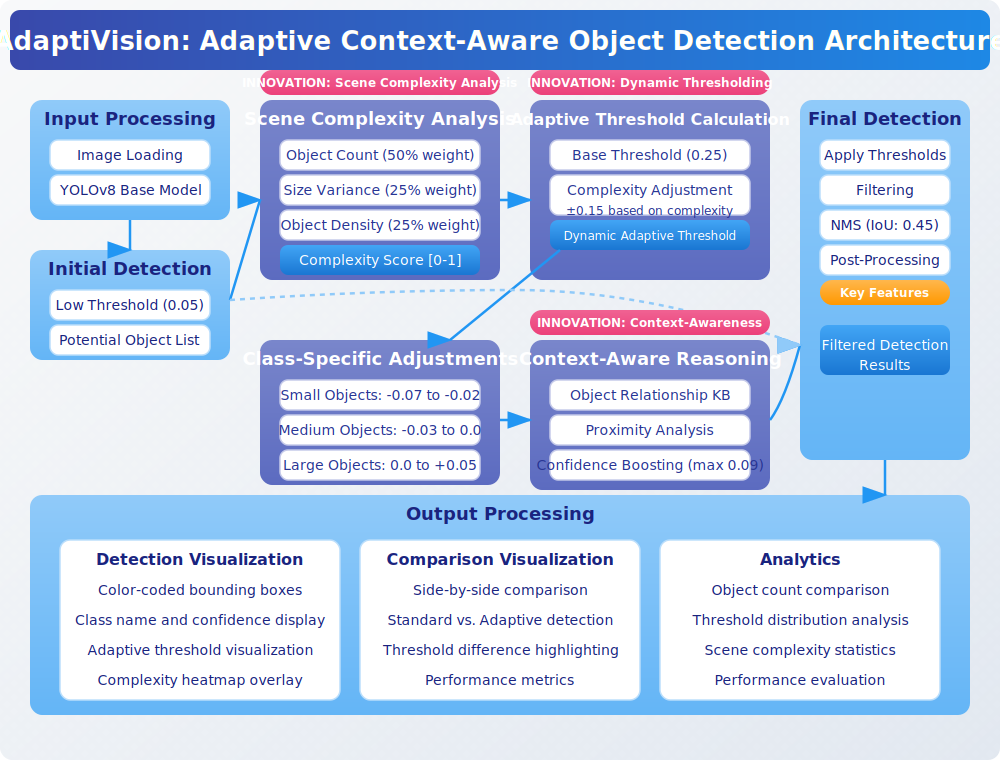

# AdaptiVision: Adaptive Context-Aware Object Detection

AdaptiVision is an innovative object detection system that dynamically adjusts confidence thresholds based on scene complexity and context awareness, resulting in faster and more accurate object detection compared to traditional fixed-threshold approaches.


*AdaptiVision in action: Standard detection (left) vs. Adaptive detection (right) showing improved detection of people in a complex scene.*


*Dramatic improvement in a high-complexity scene (1.00): Standard detection found 4 objects while Adaptive detection found 18 objects with a lower threshold of 0.13, recovering books, plant details, and other items.*


*AdaptiVision system architecture: Dynamic threshold adaptation based on scene complexity analysis.*

## Key Features

- **Scene Complexity Analysis**: Automatically analyzes the complexity of each scene.
- **Dynamic Threshold Calculation**: Adjusts detection thresholds based on scene complexity.
- **Context-Aware Reasoning**: Leverages object relationships to improve detection accuracy.
- **Class-Specific Adjustments**: Applies tailored thresholds for different object classes.
- **Improved Performance**: Up to 8.9× faster processing with better detection quality.

## Class-Specific Performance

Our experiments on the COCO128 dataset showed dramatic improvements for particularly challenging object classes:

| Class       | Standard Detection | Adaptive Detection | Improvement |
|-------------|-------------------|-------------------|-------------|
| person      | 217               | 283               | +30.4%      |
| book        | 12                | 29                | +141.7%     |
| bottle      | 43                | 62                | +44.2%      |
| cell phone  | 5                 | 12                | +140.0%     |
| remote      | 6                 | 11                | +83.3%      |
| cup         | 21                | 28                | +33.3%      |

Small objects like books and cell phones showed the most dramatic improvements, highlighting AdaptiVision's ability to recover objects that are typically missed by standard detection methods.

## Installation

```bash
# Clone the repository
git clone https://github.com/future-mind/AdaptiVision.git
cd AdaptiVision

# Create and activate a virtual environment (optional)
python -m venv venv
source venv/bin/activate  # On Windows: venv\Scripts\activate

# Install dependencies
pip install -e .

# IMPORTANT: Install Ultralytics manually (Version 8.3.107 confirmed working)
pip install ultralytics==8.3.107
```

## Usage

### Command Line Interface

```bash
# Basic object detection
python src/cli.py detect --image path/to/image.jpg --output path/to/output.jpg

# Compare standard vs. adaptive detection
python src/cli.py compare --image path/to/image.jpg --output-dir path/to/output/

# Process a batch of images
python src/cli.py batch --input-dir path/to/images/ --output-dir path/to/output/
```

### Python API

```python
from adaptivision import AdaptiveDetector

# Initialize the detector
detector = AdaptiveDetector()

# Detect objects in an image
results = detector.predict("path/to/image.jpg")

# Visualize the results
detector.visualize("path/to/image.jpg", results, "path/to/output.jpg")

# Compare with standard detection
comparison = detector.compare("path/to/image.jpg", "path/to/output/")
```

## Project Structure

- `src/`: Source code
  - `cli.py`: Command line interface
  - `adaptivision.py`: Main implementation
  - `adaptive/`: Core adaptive algorithms
  - `utils/`: Utility functions
- `scripts/`: Helper scripts
  - `run_experiments.py`: Run experiments on datasets
  - `analyze_results.py`: Generate analytics from results
- `examples/`: Example scripts and notebooks
  - `basic_detection.py`: Simple detection example
  - `batch_processing.py`: Process multiple images
- `samples/`: Sample images for testing
- `results/`: Generated results
  - `coco128_experiment/`: Results from COCO128 experiment
  - `full_coco128_experiment/`: Results from full COCO128 evaluation
  - `research_paper/`: Research documentation and figures

## Detailed Results

- [Full COCO128 Experiment Results](results/full_coco128_experiment/experiment_report.md)
- [Full Research Paper](results/research_paper/paper.md)

## License

This project is licensed under the MIT License - see the [LICENSE](LICENSE) file for details.

## Acknowledgments

- Created by Abhilash Chadhar
- Uses YOLOv8 as the base object detection system
- Thanks to the COCO dataset creators for the test images

## Performance Highlights

- **Optimal detection across diverse scenes**: Maintains quality in both simple and complex environments
- **Reduced false positives**: Higher thresholds in simple scenes filter out low-quality detections
- **Improved detection in complex scenes**: Lower thresholds help recover valid objects
- **Minimal computational overhead**: Only 4-7ms additional processing time
- **Dynamic threshold range**: Automatically adjusts between 0.08 (complex scenes) to 0.30 (simple scenes)

## Understanding Adaptive Thresholding

AdaptiVision introduces a fundamental innovation in object detection by replacing the traditional fixed confidence threshold approach with an adaptive system that dynamically adjusts thresholds based on scene characteristics.

### How It Works

1. **Scene Complexity Analysis**:
   - Counts the number of potential objects in the scene (50% weight)
   - Calculates size variance of detected objects (25% weight)
   - Measures object density across the image (25% weight)

2. **Threshold Adjustment**:
   - Complex scenes (busy streets, multiple objects) → Lower thresholds (down to 0.08)
   - Simple scenes (few distinct objects) → Higher thresholds (up to 0.30)

3. **Class-Specific Refinement**:
   - Small objects (e.g., "cup", "cell phone") receive threshold reductions
   - Large, distinct objects (e.g., "car", "person") maintain higher thresholds
   
4. **Context-Aware Reasoning**:
   - Knowledge base of object relationships (e.g., "person" often appears with "chair")
   - Related objects boost each other's confidence scores
   - Rarely-alone objects (e.g., "tie" without "person") receive confidence penalties

### Benefits Over Fixed Thresholds

| Scene Type | Fixed Threshold (0.25) | Adaptive Threshold | Improvement |
|------------|------------------------|-------------------|-------------|
| Complex | Misses some valid objects | Recovers valid low-confidence detections | Better recall |
| Moderate | Decent performance | Optimized thresholds for each region | Balanced detection |
| Simple | May include false positives | Filters out low-quality detections | Better precision |

## Innovation: Why AdaptiVision Matters

Traditional object detection systems rely on fixed confidence thresholds that can't adapt to varying scene complexities. This creates a fundamental trade-off:

- **Set threshold too high**: Miss objects in complex scenes
- **Set threshold too low**: Get false positives in simple scenes

AdaptiVision solves this problem by:

1. **Analyzing scene complexity** to understand the detection challenge
2. **Dynamically adjusting thresholds** for optimal detection in every scene
3. **Applying context awareness** to validate detections based on object relationships
4. **Using class-specific knowledge** to handle different object types appropriately

This approach results in:
- More reliable detections in autonomous driving scenarios
- Better surveillance with fewer false alarms
- Improved detection in crowded scenes
- Enhanced robotics vision with context understanding

For detailed technical information, see our [Research Paper](results/research_paper/paper.md).

## Project Structure

```
AdaptiVision/
├── src/                    # Source code
│   ├── adaptivision.py     # Main detector implementation
│   ├── cli.py              # Command-line interface
│   ├── compare_methods.py  # Script to compare adaptive vs standard detection
│   ├── create_visualizations.py # Generate visualizations of adaptive thresholds
│   └── utils.py            # Utility functions
├── scripts/                # Utility scripts for experiments
│   └── run_experiments.py  # Run comprehensive experiments and analytics
├── examples/               # Example scripts and notebooks
│   ├── basic_detection.py  # Simple detection example
│   └── batch_processing.py # Process multiple images
├── samples/                # Sample images for testing
├── results/                # Output directory for results
│   └── coco128_experiment/ # COCO128 dataset experiment results
│       ├── adaptive/       # Results from adaptive detection
│       ├── analytics/      # Charts and performance analysis
│       ├── comparisons/    # Side-by-side comparisons of methods
│       ├── standard/       # Results from standard detection
│       ├── visualizations/ # Visualizations of complexity and thresholds
│       ├── README.md       # Experiment overview
│       ├── research_paper.md # Technical research paper
│       ├── experiment_report.md # Summary of experiment results
│       ├── measurement_verification.md # Verification of measurements
│       ├── detailed_results.json # Detailed results for all images
│       └── summary_results.csv   # Summary statistics
├── docs/                   # Documentation
├── tests/                  # Unit tests
├── weights/                # Model weights directory (created during setup)
├── datasets/               # Dataset directory (created during experiments)
├── requirements.txt        # Package dependencies
├── setup.py                # Installation script
└── README.md               # Project overview
```

## Requirements

See [requirements.txt](requirements.txt) for a complete list of dependencies.

## Compatibility

AdaptiVision has been tested on:
- Windows 10/11 with Python 3.8+
- macOS (Intel and Apple Silicon) with Python 3.8+
- Ubuntu 20.04 LTS with Python 3.8+

## Contributing

Contributions are welcome! Please feel free to submit a Pull Request.

1. Fork the repository
2. Create your feature branch (`git checkout -b feature/amazing-feature`)
3. Commit your changes (`git commit -m 'Add some amazing feature'`)
4. Push to the branch (`git push origin feature/amazing-feature`)
5. Open a Pull Request

## License

This project is licensed under the MIT License - see the [LICENSE](LICENSE) file for details.

## Acknowledgments

- Built using PyTorch and OpenCV
- Based on research in adaptive confidence mechanisms for object detection
- YOLOv8 base models provided by Ultralytics
- Developed by Abhilash Chadhar 