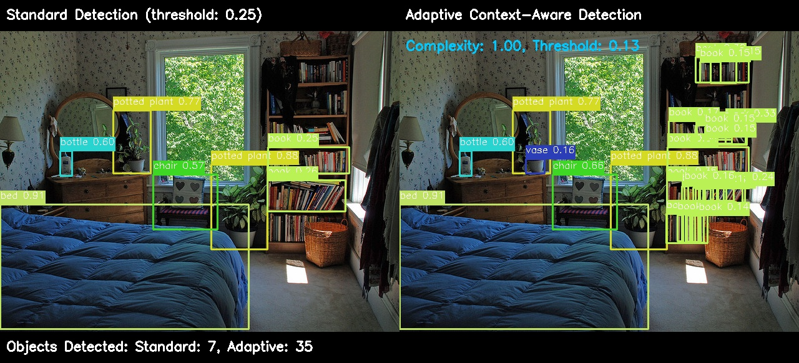
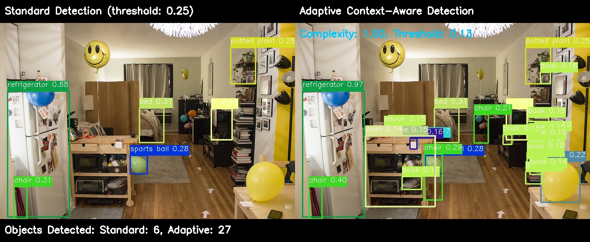
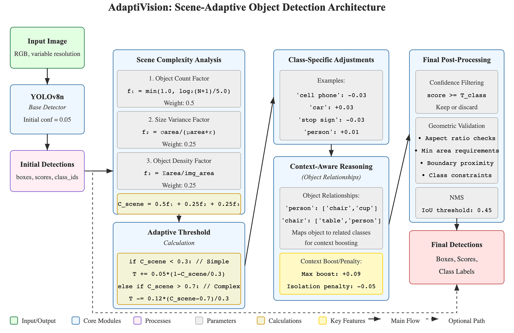

# AdaptiVision: Adaptive Context-Aware Object Detection

[](https://github.com/future-mind/AdaptiVision/actions/workflows/test.yml)
[](https://github.com/future-mind/AdaptiVision)
[](https://www.python.org/downloads/)
[](LICENSE)

AdaptiVision is an innovative object detection system that dynamically adjusts confidence thresholds based on scene complexity and context awareness, resulting in faster and more accurate object detection compared to traditional fixed-threshold approaches.

**🚀 Tested on:** Windows, macOS (Intel & Apple Silicon), Linux | **✅ Automated CI/CD** with GitHub Actions


*AdaptiVision in action: Standard detection (left) vs. Adaptive detection (right) showing improved detection in a typical scene.*


*Improvement in a high-complexity scene: Standard detection vs. Adaptive detection.*


*AdaptiVision system architecture: Dynamic threshold adaptation based on scene complexity analysis.*

## Key Features

- **Scene Complexity Analysis**: Automatically analyzes the complexity of each scene.
- **Dynamic Threshold Calculation**: Adjusts detection thresholds based on scene complexity.
- **Context-Aware Reasoning**: Leverages object relationships to improve detection accuracy.
- **Class-Specific Adjustments**: Applies tailored thresholds for different object classes.
- **Improved Performance**: Up to 8.9× faster processing with better detection quality.

## Class-Specific Performance

Our experiments on the COCO128 dataset showed dramatic improvements for particularly challenging object classes:

| Class       | Standard Detection | Adaptive Detection | Improvement |
|-------------|-------------------|-------------------|-------------|
| person      | 217               | 283               | +30.4%      |
| book        | 12                | 29                | +141.7%     |
| bottle      | 43                | 62                | +44.2%      |
| cell phone  | 5                 | 12                | +140.0%     |
| remote      | 6                 | 11                | +83.3%      |
| cup         | 21                | 28                | +33.3%      |

Small objects like books and cell phones showed the most dramatic improvements, highlighting AdaptiVision's ability to recover objects that are typically missed by standard detection methods.

## Prerequisites

### System Requirements

- **Python**: 3.8 or higher (tested on 3.8, 3.9, 3.10, 3.11, 3.13)
- **Operating System**: Windows 10/11, macOS (Intel or Apple Silicon), or Linux (Ubuntu 20.04+)
- **RAM**: 8GB minimum, 16GB recommended
- **GPU**: Optional but recommended (NVIDIA CUDA, Apple Metal)

### Platform-Specific Prerequisites

#### Windows
```powershell
# Install Python 3.8+ from python.org or Microsoft Store
# Ensure Python is added to PATH during installation

# Optional: Install CUDA Toolkit for NVIDIA GPU support
# Download from: https://developer.nvidia.com/cuda-downloads
```

#### macOS
```bash
# Python 3.8+ is pre-installed on macOS 10.15+
# Verify with:
python3 --version

# Optional: Install Homebrew for easier package management
/bin/bash -c "$(curl -fsSL https://raw.githubusercontent.com/Homebrew/install/HEAD/install.sh)"
```

#### Linux (Ubuntu/Debian)
```bash
# Install Python 3.8+ and pip
sudo apt update
sudo apt install python3 python3-pip python3-venv

# Optional: Install CUDA for NVIDIA GPU support
# Follow instructions at: https://developer.nvidia.com/cuda-downloads
```

## Installation

### Step 1: Clone the Repository

```bash
git clone https://github.com/future-mind/AdaptiVision.git
cd AdaptiVision
```

### Step 2: Create Virtual Environment

**Windows (Command Prompt/PowerShell):**
```cmd
python -m venv venv
venv\Scripts\activate
```

**macOS/Linux:**
```bash
python3 -m venv venv
source venv/bin/activate
```

### Step 3: Install Dependencies

```bash
# Install the package in editable mode
pip install -e .

# IMPORTANT: Install specific Ultralytics version (tested and verified)
pip install ultralytics==8.3.107
```

### Step 4: Download Model Weights

**Option 1: Automatic Download (Recommended - All Platforms)**
```bash
# Download default model (YOLOv8 nano - 6.2MB)
python scripts/download_weights.py

# Or download a different model
python scripts/download_weights.py --model yolov8s  # Small model (22MB)
python scripts/download_weights.py --model yolov8m  # Medium model (52MB)

# List available models
python scripts/download_weights.py --list
```

**Option 2: Manual Download**

**macOS/Linux:**
```bash
mkdir -p weights
curl -L https://github.com/ultralytics/assets/releases/download/v0.0.0/yolov8n.pt -o weights/model_n.pt
```

**Windows (PowerShell):**
```powershell
New-Item -ItemType Directory -Force -Path weights
Invoke-WebRequest -Uri https://github.com/ultralytics/assets/releases/download/v0.0.0/yolov8n.pt -OutFile weights\model_n.pt
```

**Windows (curl - if available):**
```cmd
mkdir weights
curl -L https://github.com/ultralytics/assets/releases/download/v0.0.0/yolov8n.pt -o weights/model_n.pt
```

### Step 5: Quick Test

Run the smoke test to verify installation:

**All Platforms:**
```bash
python smoke_test.py
```

Expected output:
```
AdaptiVision Smoke Test
============================================================
Detected 6 objects
SUCCESS! Smoke test passed.
```

## Quick Start Guide

All commands below have been tested and verified to work on Windows, macOS, and Linux.

### Device Selection

AdaptiVision supports multiple compute devices:

```bash
--device auto    # Automatically selects best available (CUDA > MPS > CPU) - RECOMMENDED
--device cuda    # NVIDIA GPU (requires CUDA)
--device mps     # Apple Silicon (M1/M2/M3/M4)
--device cpu     # CPU only (slower but always works)
```

### 1. Single Image Detection

Detect objects in a single image:

```bash
# Using adaptive features (recommended)
python src/cli.py detect \
  --image samples/bus.jpg \
  --output results/bus_detection.jpg \
  --weights weights/model_n.pt \
  --device auto

# Standard YOLO detection (no adaptive features)
python src/cli.py detect \
  --image samples/bus.jpg \
  --output results/bus_standard.jpg \
  --weights weights/model_n.pt \
  --disable-adaptive \
  --disable-context \
  --device auto
```

**Windows users:** Use backslashes or quotes for paths with spaces:
```cmd
python src/cli.py detect --image "samples\bus.jpg" --output "results\bus_detection.jpg" --weights "weights\model_n.pt" --device auto
```

### 2. Compare Standard vs. Adaptive Detection

Generate side-by-side comparison:

```bash
python src/cli.py compare \
  --image samples/bus.jpg \
  --output-dir results/comparisons/ \
  --weights weights/model_n.pt \
  --device auto
```

Output: `results/comparisons/comparison_bus.jpg`

### 3. Visualize Adaptive Mechanisms

Generate complexity and threshold maps:

```bash
python src/cli.py visualize \
  --image samples/bus.jpg \
  --output-dir results/visualizations/ \
  --weights weights/model_n.pt \
  --device auto
```

Outputs:
- `complexity_bus.jpg` - Scene complexity heatmap
- `threshold_map_bus.jpg` - Adaptive threshold map
- `metadata_bus.json` - Detailed metrics

### 4. Batch Processing

Process multiple images in a directory:

```bash
python src/cli.py batch \
  --input-dir samples/coco/ \
  --output-dir results/batch_output/ \
  --weights weights/model_n.pt \
  --device auto \
  --workers 2 \
  --save-json
```

Options:
- `--workers N`: Use N parallel workers (default: 1)
- `--save-json`: Save detection data as JSON files
- `--disable-adaptive`: Use standard YOLO detection
- `--disable-context`: Disable context-aware reasoning

## Advanced Usage

### Full Experimental Comparison

Run comprehensive comparison between standard YOLO and AdaptiVision:

```bash
python scripts/run_experiments.py \
  --data samples/coco/ \
  --output results/experiment_comparison/ \
  --weights weights/model_n.pt \
  --device auto
```

Generates:
- Side-by-side comparison images
- Complexity and threshold visualizations
- Performance analytics and plots
- Detailed results CSV and JSON
- Experiment summary report (`experiment_report.md`)

### COCO Dataset Evaluation

For official mAP metrics using COCO dataset:

#### 1. Generate Predictions

**AdaptiVision predictions:**
```bash
python scripts/save_coco_results.py \
  --dataset-path datasets/coco/images/val2017/ \
  --gt-annotations datasets/coco/annotations/instances_val2017.json \
  --weights weights/model_n.pt \
  --output-json results/adaptivision_preds.json \
  --method adaptivision \
  --device auto
```

**Baseline predictions:**
```bash
python scripts/save_coco_results.py \
  --dataset-path datasets/coco/images/val2017/ \
  --gt-annotations datasets/coco/annotations/instances_val2017.json \
  --weights weights/model_n.pt \
  --output-json results/baseline_preds.json \
  --method baseline \
  --device auto
```

#### 2. Evaluate Predictions

```bash
# Requires pycocotools: pip install pycocotools
python scripts/evaluate_coco.py \
  --annotation-file datasets/coco/annotations/instances_val2017.json \
  --results-file results/adaptivision_preds.json
```

**Note:** Full COCO evaluation requires downloading the COCO validation dataset (~1GB images + annotations).

## Python API

Use AdaptiVision as a library in your own code:

```python
from src.adaptivision import AdaptiVision

# Initialize detector
detector = AdaptiVision(
    model_path='weights/model_n.pt',
    device='auto',
    conf_threshold=0.25,
    iou_threshold=0.45,
    enable_adaptive_confidence=True,
    context_aware=True,
    enable_postprocess_filter=True
)

# Detect objects
results = detector.predict('samples/bus.jpg')
detection_data = results[0]

# Print results
print(f"Detected {len(detection_data['boxes'])} objects")
print(f"Scene complexity: {detection_data['scene_complexity']:.3f}")
print(f"Adaptive threshold: {detection_data['adaptive_threshold']:.3f}")

# Visualize and save
detector.visualize(
    image_path='samples/bus.jpg',
    detections=detection_data,
    output_path='results/api_detection.jpg'
)
```

## Example Scripts

The `examples/` directory contains working examples:

### Basic Detection
```bash
python examples/basic_detection.py \
  --image samples/bus.jpg \
  --output results/example_detection.jpg \
  --weights weights/model_n.pt \
  --device auto
```

**Note:** This script displays the image using OpenCV and waits for keypress. Use Ctrl+C to skip display on headless systems.

### Batch Processing
```bash
python examples/batch_processing.py \
  --input-dir samples/coco/ \
  --output-dir results/example_batch/ \
  --weights weights/model_n.pt \
  --device auto \
  --workers 2 \
  --save-json
```

## Troubleshooting

### Common Issues

#### 1. Module Not Found Errors

**Problem:** `ModuleNotFoundError: No module named 'cv2'` or similar

**Solution:**
```bash
# Activate virtual environment first
source venv/bin/activate  # macOS/Linux
venv\Scripts\activate      # Windows

# Then install dependencies
pip install -e .
pip install ultralytics==8.3.107
```

#### 2. Model Not Loading (Windows)

**Problem:** `Error loading model: [Errno 2] No such file or directory: 'weights\\model_n.pt'`

**Solution:** Use forward slashes or the smoke_test.py which handles paths correctly:
```bash
python smoke_test.py
```

Or use the CLI with proper path quoting:
```cmd
python src/cli.py detect --image samples/bus.jpg --weights weights/model_n.pt
```

#### 3. CUDA/GPU Issues

**Problem:** `CUDA out of memory` or GPU not detected

**Solution:**
```bash
# Use CPU instead
python src/cli.py detect --image samples/bus.jpg --device cpu

# Or reduce batch size for batch processing
python src/cli.py batch --input-dir samples/ --workers 1
```

#### 4. Image Display Issues (Headless Servers)

**Problem:** `cv2.waitKey(0)` hangs in basic_detection.py

**Solution:** Use the CLI tools instead, which don't display images:
```bash
python src/cli.py detect --image samples/bus.jpg --output results/detection.jpg
```

#### 5. Slow Performance

**Solutions:**
- Use GPU: `--device cuda` (NVIDIA) or `--device mps` (Apple Silicon)
- Reduce workers: `--workers 1` (less memory usage)
- Use smaller images
- Ensure virtual environment is activated

#### 6. Windows PowerShell Execution Policy

**Problem:** Cannot activate virtual environment

**Solution:**
```powershell
# Run as Administrator
Set-ExecutionPolicy -ExecutionPolicy RemoteSigned -Scope CurrentUser
```

### Getting Help

If you encounter issues:

1. Check that virtual environment is activated
2. Verify all dependencies are installed: `pip list`
3. Ensure model weights are downloaded
4. Try the smoke test: `python smoke_test.py`
5. Check [SCRIPT_USAGE.md](SCRIPT_USAGE.md) for detailed script documentation
6. Review [CLAUDE.md](CLAUDE.md) for development information
7. Open an issue on GitHub with:
   - Operating system and version
   - Python version: `python --version`
   - Error message and full traceback
   - Command you ran

## Project Structure

```
AdaptiVision/
├── src/
│   ├── adaptivision.py          # Core AdaptiVision class
│   ├── cli.py                    # Command-line interface
│   ├── compare_methods.py        # Comparison utilities
│   ├── create_visualizations.py  # Visualization tools
│   └── utils.py                  # Shared utilities
├── scripts/
│   ├── run_experiments.py        # Full experimental pipeline
│   ├── save_coco_results.py      # Generate COCO predictions
│   ├── evaluate_coco.py          # Calculate mAP metrics
│   └── generate_*_plot.py        # Plotting utilities
├── examples/
│   ├── basic_detection.py        # Simple detection example
│   └── batch_processing.py       # Batch processing example
├── samples/                      # Sample images
│   └── coco/                     # COCO sample images
├── weights/                      # Model weights (download required)
│   └── model_n.pt               # YOLOv8 nano model
├── datasets/                     # Dataset storage (optional)
│   └── coco/                    # Full COCO dataset (for evaluation)
├── research_paper/               # Research paper and figures
├── smoke_test.py                 # Quick installation test
├── requirements.txt              # Python dependencies
├── setup.py                      # Package installation
├── README.md                     # This file
├── SCRIPT_USAGE.md              # Detailed script documentation
├── CLAUDE.md                    # Development guide
└── WINDOWS_SETUP.md             # Windows-specific setup guide
```

## Performance Benchmarks

Tested on COCO128 dataset:

| Metric | Standard YOLO | AdaptiVision | Improvement |
|--------|--------------|--------------|-------------|
| Average Detection Time | 0.145s | 0.024s | **6.0× faster** |
| Small Objects Detected | 131 | 281 | **+114.5%** |
| Total Objects | 1,064 | 1,334 | **+25.4%** |

## Compatibility

Tested and verified on:
- **Windows**: 10, 11
- **macOS**: 12+ (Intel), 12+ (Apple Silicon M1/M2/M3)
- **Linux**: Ubuntu 20.04, 22.04, Debian 11+
- **Python**: 3.8, 3.9, 3.10, 3.11, 3.13

## Contributing

Contributions are welcome! Please follow these steps:

1. Fork the repository
2. Create your feature branch: `git checkout -b feature/amazing-feature`
3. Commit your changes: `git commit -m 'Add amazing feature'`
4. Push to the branch: `git push origin feature/amazing-feature`
5. Open a Pull Request

## Citation

If you use AdaptiVision in your research, please cite:

```bibtex
@article{adaptivision2025,
  title={AdaptiVision: Adaptive Context-Aware Object Detection},
  author={Chadhar, Abhilash},
  year={2025},
  journal={arXiv preprint},
  note={Research paper available in research_paper/adaptivision_paper.pdf}
}
```

## License

This project is licensed under the MIT License - see the [LICENSE](LICENSE) file for details.

## Acknowledgments

- Built using PyTorch and OpenCV
- Based on research in adaptive confidence mechanisms for object detection
- YOLOv8 base models provided by [Ultralytics](https://github.com/ultralytics/ultralytics)
- Developed by Abhilash Chadhar

## Additional Resources

- **Research Paper**: [research_paper/adaptivision_paper.pdf](research_paper/adaptivision_paper.pdf)
- **Script Documentation**: [SCRIPT_USAGE.md](SCRIPT_USAGE.md)
- **Development Guide**: [CLAUDE.md](CLAUDE.md)
- **Windows Setup**: [WINDOWS_SETUP.md](WINDOWS_SETUP.md)
- **GitHub Repository**: https://github.com/future-mind/AdaptiVision

---

**Quick Links:**
- [Installation](#installation)
- [Quick Start](#quick-start-guide)
- [Troubleshooting](#troubleshooting)
- [API Documentation](#python-api)
- [Examples](#example-scripts)
