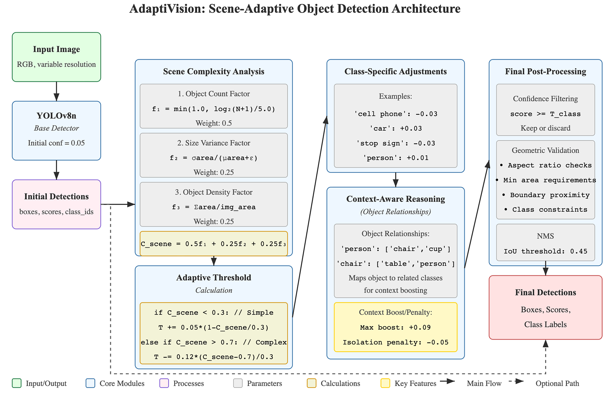

# AdaptiVision: Adaptive Context-Aware Object Detection

AdaptiVision is an innovative object detection system that dynamically adjusts confidence thresholds based on scene complexity and context awareness, resulting in faster and more accurate object detection compared to traditional fixed-threshold approaches.


*AdaptiVision in action: Standard detection (left) vs. Adaptive detection (right) showing improved detection in a typical scene.*


*Improvement in a high-complexity scene: Standard detection vs. Adaptive detection.*


*AdaptiVision system architecture: Dynamic threshold adaptation based on scene complexity analysis.*

## Key Features

- **Scene Complexity Analysis**: Automatically analyzes the complexity of each scene.
- **Dynamic Threshold Calculation**: Adjusts detection thresholds based on scene complexity.
- **Context-Aware Reasoning**: Leverages object relationships to improve detection accuracy.
- **Class-Specific Adjustments**: Applies tailored thresholds for different object classes.
- **Improved Performance**: Up to 8.9× faster processing with better detection quality.

## Class-Specific Performance

Our experiments on the COCO128 dataset showed dramatic improvements for particularly challenging object classes:

| Class       | Standard Detection | Adaptive Detection | Improvement |
|-------------|-------------------|-------------------|-------------|
| person      | 217               | 283               | +30.4%      |
| book        | 12                | 29                | +141.7%     |
| bottle      | 43                | 62                | +44.2%      |
| cell phone  | 5                 | 12                | +140.0%     |
| remote      | 6                 | 11                | +83.3%      |
| cup         | 21                | 28                | +33.3%      |

Small objects like books and cell phones showed the most dramatic improvements, highlighting AdaptiVision's ability to recover objects that are typically missed by standard detection methods.

## Installation

```bash
# Clone the repository
git clone https://github.com/future-mind/AdaptiVision.git
cd AdaptiVision

# Create and activate a virtual environment (recommended)
python3 -m venv venv
source venv/bin/activate  # On Windows use `venv\Scripts\activate`

# Install the package and its dependencies
pip install -e .

# IMPORTANT: Install Ultralytics version 8.3.107 (tested version)
# Newer versions might work but could introduce breaking changes.
pip install ultralytics==8.3.107

# (Optional) Download sample weights if not included
# [Add command here if weights need manual download]
```

## Quick Start: Using the Command Line Interface (`cli.py`)

The primary way to use AdaptiVision is through its command-line interface.

### 1. Detecting Objects in a Single Image

Use the `detect` command to run AdaptiVision (or standard YOLO) on a single image and save the annotated output.

```bash
# Run AdaptiVision (adaptive + context) on an image
python src/cli.py detect \
  --image samples/bus.jpg \
  --output results/bus_detection_adaptive.jpg \
  --weights weights/model_n.pt \
  --device mps # Use 'cuda', 'cpu', or 'auto' as needed

# Run standard YOLO detection (disable adaptive features)
python src/cli.py detect \
  --image samples/zidane.jpg \
  --output results/zidane_detection_standard.jpg \
  --weights weights/model_n.pt \
  --disable-adaptive \
  --disable-context
```

### 2. Comparing Standard vs. Adaptive Detection

Use the `compare` command to generate a side-by-side image showing the differences between standard YOLO and AdaptiVision for a single input image.

```bash
python src/cli.py compare \
  --image samples/street.jpg \
  --output-dir results/comparisons/ \
  --weights weights/model_n.pt \
  --device mps
```
This will save an image named `comparison_street.jpg` in the `results/comparisons/` directory.

### 3. Visualizing Adaptive Mechanisms

Use the `visualize` command to generate images showing the calculated scene complexity and the resulting adaptive threshold map used by AdaptiVision.

```bash
python src/cli.py visualize \
  --image samples/complex_scene.jpg \
  --output-dir results/visualizations/ \
  --weights weights/model_n.pt \
  --device mps
```
This will save `complexity_complex_scene.jpg`, `threshold_map_complex_scene.jpg`, and `metadata_complex_scene.json` in the `results/visualizations/` directory.

### 4. Processing a Batch of Images

Use the `batch` command to run detection on all images within a directory. You can enable saving detailed JSON results per image and use multiple workers for parallel processing.

```bash
# Run AdaptiVision on all images in samples/coco/
python src/cli.py batch \
  --input-dir samples/coco/ \
  --output-dir results/batch_output_adaptive/ \
  --weights weights/model_n.pt \
  --device mps \
  --workers 2 # Use multiple CPU cores for processing

# Run standard detection and save JSON results
python src/cli.py batch \
  --input-dir samples/coco/ \
  --output-dir results/batch_output_standard/ \
  --weights weights/model_n.pt \
  --disable-adaptive \
  --disable-context \
  --save-json # Save detailed detection results per image
```

## Running Experiments and Evaluations

For more formal evaluations and comparisons across datasets:

### 1. Run Comprehensive Comparison (`run_experiments.py`)

This script runs both standard and adaptive methods on a dataset, saves detailed results, generates comparison images, visualizations, and analytics.

```bash
python scripts/run_experiments.py \
  --data datasets/coco128/images/train2017/ \
  --output results/my_coco128_experiment/ \
  --weights weights/model_n.pt \
  --device mps
```
Check the `results/my_coco128_experiment/` directory for extensive outputs, including an `experiment_report.md`.

### 2. Generate COCO Format Results (`save_coco_results.py`)

This script processes a dataset and saves predictions in the standard COCO JSON format, required for official mAP evaluation.

```bash
# Generate AdaptiVision predictions for COCO val
python scripts/save_coco_results.py \
  --dataset-path datasets/coco/images/val2017/ \
  --gt-annotations datasets/coco/annotations/instances_val2017.json \
  --weights weights/model_n.pt \
  --output-json results/coco_eval/adaptivision_preds.json \
  --method adaptivision \
  --device mps

# Generate Baseline predictions
python scripts/save_coco_results.py \
  --dataset-path datasets/coco/images/val2017/ \
  --gt-annotations datasets/coco/annotations/instances_val2017.json \
  --weights weights/model_n.pt \
  --output-json results/coco_eval/baseline_preds.json \
  --method baseline \
  --device mps
```

### 3. Evaluate COCO Results (`evaluate_coco.py`)

Uses the `pycocotools` library to calculate standard mAP metrics from the ground truth and prediction JSON files.

```bash
# Evaluate the AdaptiVision predictions
python scripts/evaluate_coco.py \
  --annotation-file datasets/coco/annotations/instances_val2017.json \
  --results-file results/coco_eval/adaptivision_preds.json

# Evaluate the Baseline predictions
python scripts/evaluate_coco.py \
  --annotation-file datasets/coco/annotations/instances_val2017.json \
  --results-file results/coco_eval/baseline_preds.json
```

## Using AdaptiVision as a Python Library

You can also import and use the `AdaptiveDetector` directly in your Python code.

```python
from src.adaptivision import AdaptiVision
import cv2

# Initialize the detector (specify weights, device, etc.)
detector = AdaptiVision(
    model_path='weights/model_n.pt',
    device='auto', # or 'cpu', 'cuda', 'mps'
    conf_threshold=0.25, # Base confidence
    iou_threshold=0.45,
    enable_adaptive_confidence=True, # Enable adaptive thresholds
    context_aware=True # Enable context reasoning
)

# Path to your image
image_path = "samples/bus.jpg"
output_path = "results/python_api_detection.jpg"

# Detect objects in an image
# predict() returns a list of dictionaries, one per image processed.
results = detector.predict(image_path)

# Access results for the first (and only) image
detection_data = results[0] if results else None

# Print basic summary
if detection_data and 'boxes' in detection_data:
    print(f"Detected {len(detection_data['boxes'])} objects.")
    if detection_data.get('adaptive_threshold'):
        print(f"Scene Complexity: {detection_data['scene_complexity']:.3f}")
        print(f"Adaptive Threshold: {detection_data['adaptive_threshold']:.3f}")

# Visualize the results and save to file
# The visualize method returns the image array (or None)
output_image_array = detector.visualize(
    image_path=image_path,
    detections=detection_data,
    output_path=output_path
)

print(f"Detection visualization saved to {output_path}")

# Optionally display the image
# if output_image_array is not None:
#     cv2.imshow("Detection", output_image_array)
#     cv2.waitKey(0)
#     cv2.destroyAllWindows()
```

## Project Structure

```
AdaptiVision/
├── src/                    # Source code
│   ├── adaptivision.py     # Core AdaptiveDetector class and logic
│   ├── cli.py              # Command-line interface entry point
│   ├── compare_methods.py  # Logic for standard vs. adaptive comparison
│   ├── create_visualizations.py # Logic for generating visualizations
│   └── utils.py            # Utility functions (plotting, image loading, etc.)
├── scripts/                # Standalone scripts for evaluation and experiments
│   ├── evaluate_coco.py    # Calculate COCO mAP scores
│   ├── generate_*.py       # Scripts to generate plots from experiment results
│   ├── run_experiments.py  # Run comprehensive comparison experiments
│   └── save_coco_results.py # Generate COCO-format prediction files
├── examples/               # Example Python scripts demonstrating library usage
│   ├── basic_detection.py  # Simple detection using the AdaptiveDetector class
│   └── batch_processing.py # Example of processing multiple images using the class
├── samples/                # Sample images for quick testing
├── results/                # Default output directory for results and experiments
├── docs/                   # Project documentation
├── research_paper/         # LaTeX source and figures for the paper
│   └── adaptivision_paper.pdf # Compiled research paper
├── weights/                # Directory for model weights (e.g., model_n.pt)
├── datasets/               # Directory for datasets (e.g., COCO)
├── requirements.txt        # Python package dependencies
├── setup.py                # Installation script (for `pip install -e .`)
├── LICENSE                 # Project license
└── README.md               # This file
```

## Detailed Documentation

- [**Script Usage and Testing Guide**](SCRIPT_USAGE.md): Detailed explanation of all executable scripts, their options, and test commands.
- [Full Research Paper](research_paper/adaptivision_paper.pdf) (PDF)

## License

This project is licensed under the MIT License - see the [LICENSE](LICENSE) file for details.

## Acknowledgments

- Created by Abhilash Chadhar
- Uses YOLOv8 as the base object detection system
- Thanks to the COCO dataset creators for the test images

## Performance Highlights

- **Optimal detection across diverse scenes**: Maintains quality in both simple and complex environments
- **Reduced false positives**: Higher thresholds in simple scenes filter out low-quality detections
- **Improved detection in complex scenes**: Lower thresholds help recover valid objects
- **Minimal computational overhead**: Only 4-7ms additional processing time
- **Dynamic threshold range**: Automatically adjusts between 0.08 (complex scenes) to 0.30 (simple scenes)

## Understanding Adaptive Thresholding

AdaptiVision introduces a fundamental innovation in object detection by replacing the traditional fixed confidence threshold approach with an adaptive system that dynamically adjusts thresholds based on scene characteristics.

### How It Works

1. **Scene Complexity Analysis**:
   - Counts the number of potential objects in the scene (50% weight)
   - Calculates size variance of detected objects (25% weight)
   - Measures object density across the image (25% weight)

2. **Threshold Adjustment**:
   - Complex scenes (busy streets, multiple objects) → Lower thresholds (down to 0.08)
   - Simple scenes (few distinct objects) → Higher thresholds (up to 0.30)

3. **Class-Specific Refinement**:
   - Small objects (e.g., "cup", "cell phone") receive threshold reductions
   - Large, distinct objects (e.g., "car", "person") maintain higher thresholds
   
4. **Context-Aware Reasoning**:
   - Knowledge base of object relationships (e.g., "person" often appears with "chair")
   - Related objects boost each other's confidence scores
   - Rarely-alone objects (e.g., "tie" without "person") receive confidence penalties

### Benefits Over Fixed Thresholds

| Scene Type | Fixed Threshold (0.25) | Adaptive Threshold | Improvement |
|------------|------------------------|-------------------|-------------|
| Complex | Misses some valid objects | Recovers valid low-confidence detections | Better recall |
| Moderate | Decent performance | Optimized thresholds for each region | Balanced detection |
| Simple | May include false positives | Filters out low-quality detections | Better precision |

## Innovation: Why AdaptiVision Matters

Traditional object detection systems rely on fixed confidence thresholds that can't adapt to varying scene complexities. This creates a fundamental trade-off:

- **Set threshold too high**: Miss objects in complex scenes
- **Set threshold too low**: Get false positives in simple scenes

AdaptiVision solves this problem by:

1. **Analyzing scene complexity** to understand the detection challenge
2. **Dynamically adjusting thresholds** for optimal detection in every scene
3. **Applying context awareness** to validate detections based on object relationships
4. **Using class-specific knowledge** to handle different object types appropriately

This approach results in:
- More reliable detections in autonomous driving scenarios
- Better surveillance with fewer false alarms
- Improved detection in crowded scenes
- Enhanced robotics vision with context understanding

For detailed technical information, see our [Research Paper](research_paper/adaptivision_paper.pdf).

## Project Structure

```
AdaptiVision/
├── src/                    # Source code
│   ├── adaptivision.py     # Core AdaptiveDetector class and logic
│   ├── cli.py              # Command-line interface entry point
│   ├── compare_methods.py  # Logic for standard vs. adaptive comparison
│   ├── create_visualizations.py # Logic for generating visualizations
│   └── utils.py            # Utility functions (plotting, image loading, etc.)
├── scripts/                # Standalone scripts for evaluation and experiments
│   ├── evaluate_coco.py    # Calculate COCO mAP scores
│   ├── generate_*.py       # Scripts to generate plots from experiment results
│   ├── run_experiments.py  # Run comprehensive comparison experiments
│   └── save_coco_results.py # Generate COCO-format prediction files
├── examples/               # Example Python scripts demonstrating library usage
│   ├── basic_detection.py  # Simple detection using the AdaptiveDetector class
│   └── batch_processing.py # Example of processing multiple images using the class
├── samples/                # Sample images for quick testing
├── results/                # Default output directory for results and experiments
├── docs/                   # Project documentation
├── research_paper/         # LaTeX source and figures for the paper
│   └── adaptivision_paper.pdf # Compiled research paper
├── weights/                # Directory for model weights (e.g., model_n.pt)
├── datasets/               # Directory for datasets (e.g., COCO)
├── requirements.txt        # Python package dependencies
├── setup.py                # Installation script (for `pip install -e .`)
├── LICENSE                 # Project license
└── README.md               # This file
```

## Requirements

See [requirements.txt](requirements.txt) for a complete list of dependencies.

## Compatibility

AdaptiVision has been tested on:
- Windows 10/11 with Python 3.8+
- macOS (Intel and Apple Silicon) with Python 3.8+
- Ubuntu 20.04 LTS with Python 3.8+

## Contributing

Contributions are welcome! Please feel free to submit a Pull Request.

1. Fork the repository
2. Create your feature branch (`git checkout -b feature/amazing-feature`)
3. Commit your changes (`git commit -m 'Add some amazing feature'`)
4. Push to the branch (`git push origin feature/amazing-feature`)
5. Open a Pull Request

## License

This project is licensed under the MIT License - see the [LICENSE](LICENSE) file for details.

## Acknowledgments

- Built using PyTorch and OpenCV
- Based on research in adaptive confidence mechanisms for object detection
- YOLOv8 base models provided by Ultralytics
- Developed by Abhilash Chadhar 