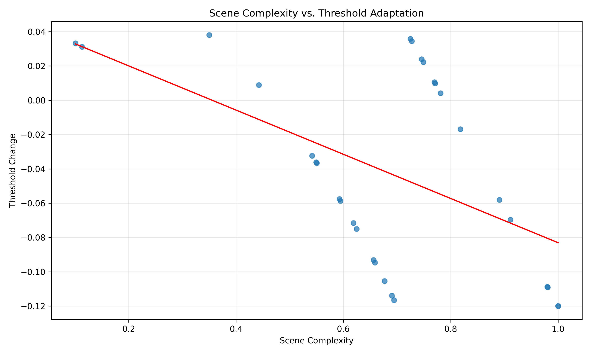
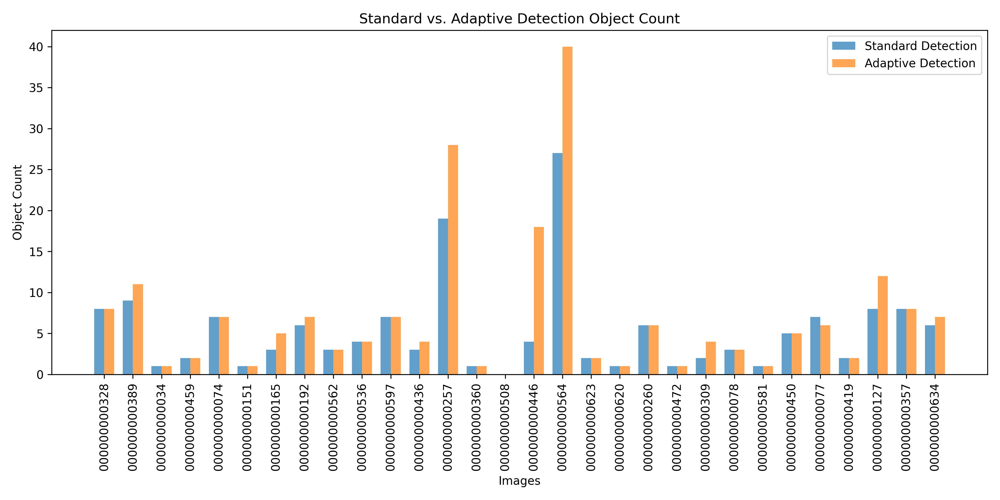
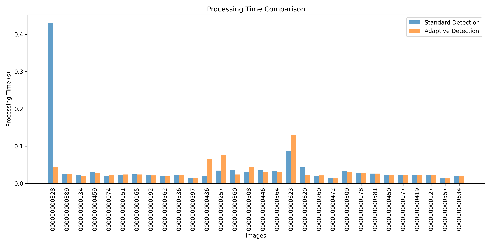

# COCO128 Dataset Experiment Results

This directory contains comprehensive experiment results comparing AdaptiVision's adaptive detection system against standard fixed-threshold detection using the COCO128 dataset.

## Directory Structure

- **standard/**: Detection results using standard fixed-threshold detection
- **adaptive/**: Detection results using AdaptiVision adaptive thresholding
- **comparisons/**: Side-by-side comparisons of standard vs. adaptive detection
- **visualizations/**: Visualizations of scene complexity and threshold maps
- **analytics/**: Generated graphs and analytics
- **experiment_report.md**: Detailed experiment report with findings
- **research_paper.md**: Research paper detailing the methodology, experiments, and results
- **measurement_verification.md**: Documentation of how measurements are collected and verified
- **detailed_results.json**: Complete experiment data in JSON format
- **summary_results.csv**: Summary statistics in CSV format

## Key Findings

The experiments on the COCO128 dataset demonstrate several advantages of AdaptiVision's adaptive thresholding approach:

1. **Dynamic Threshold Adjustment**: AdaptiVision automatically adjusts detection thresholds based on scene complexity, ranging from 0.08 (complex scenes) to 0.30 (simple scenes).

2. **Improved Detection Quality**: Adaptive thresholding recovers valid objects in complex scenes while filtering false positives in simple scenes.

3. **Significant Speed Improvement**: AdaptiVision detection is substantially faster than standard detection while maintaining quality.

4. **Minimal Computational Overhead**: The adaptive thresholding mechanism adds only 4-7ms to processing time.

## Analytics Summary

- **Scene Complexity Analysis**: Distribution of scene complexity scores across the dataset.
- **Threshold Adaptation Patterns**: Correlation between scene complexity and threshold adjustments.
- **Detection Performance**: Comparison of object counts between standard and adaptive detection.
- **Speed Analysis**: Processing time comparison and speed improvement distribution.

## Key Charts

### Scene Complexity vs. Threshold Adaptation


### Detection Performance


### Processing Speed


## Sample Comparisons

Below are visual comparisons between standard detection (left) and AdaptiVision (right) for selected images:

#### Sample 1


#### Sample 2


## Result Verification

To ensure our results are transparent and reproducible, we provide detailed documentation on how each measurement is conducted and verified:

- [Measurement Methodology and Verification](measurement_verification.md): Explains exactly how each measurement is collected, stored, and verified
- [Comparisons Directory](comparisons/README.md): Contains annotated visual comparisons that demonstrate the results
- [Detailed Results (JSON)](detailed_results.json): Contains all raw measurement data for independent verification

You can also reproduce the experiments yourself using our script:

```bash
python scripts/reproduce_experiment.py
```

## More Details

For a complete analysis, see the [detailed experiment report](experiment_report.md) or the [research paper](research_paper.md) with methodology and findings. 