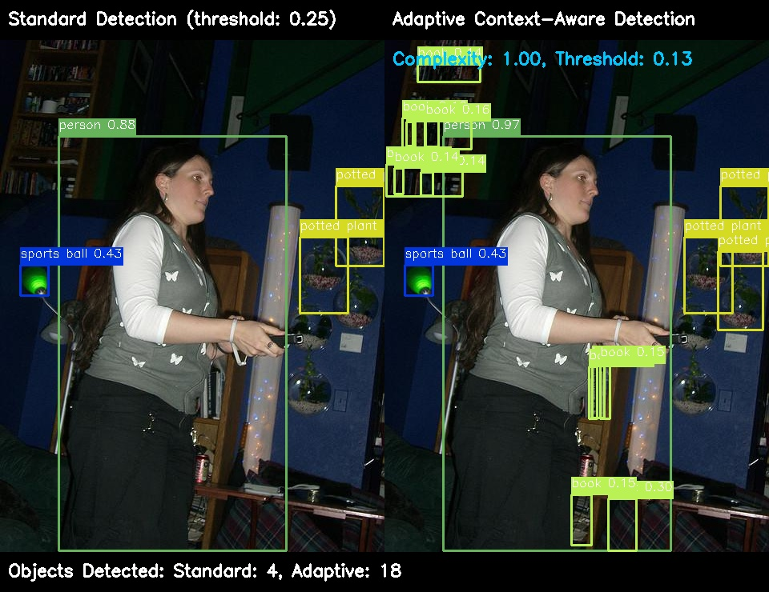

# AdaptiVision Comparison Images

This directory contains side-by-side comparisons of standard YOLO detection (left) versus AdaptiVision adaptive detection (right).

## Available Comparisons

Click on any image to view the full-size comparison:

### Image 1: 000000000034.jpg

**Details:**
- Scene complexity: 0.35
- Adaptive threshold: 0.28804687500000004 (base threshold: 0.25)
- Standard detection: N/A objects
- Adaptive detection: N/A objects
- Speed improvement: N/Ax

### Image 2: 000000000074.jpg

**Details:**
- Scene complexity: 0.8906890595608519
- Adaptive threshold: 0.19194286624885057 (base threshold: 0.25)
- Standard detection: N/A objects
- Adaptive detection: N/A objects
- Speed improvement: N/Ax

### Image 3: 000000000077.jpg

**Details:**
- Scene complexity: 0.7459037019401729
- Adaptive threshold: 0.273987902233902 (base threshold: 0.25)
- Standard detection: N/A objects
- Adaptive detection: N/A objects
- Speed improvement: N/Ax

### Image 4: 000000000078.jpg

**Details:**
- Scene complexity: 0.5495188187622653
- Adaptive threshold: 0.2139018167761194 (base threshold: 0.25)
- Standard detection: N/A objects
- Adaptive detection: N/A objects
- Speed improvement: N/Ax

### Image 5: 000000000127.jpg

**Details:**
- Scene complexity: 0.9807354922057604
- Adaptive threshold: 0.14091655441673576 (base threshold: 0.25)
- Standard detection: N/A objects
- Adaptive detection: N/A objects
- Speed improvement: N/Ax

### Image 6: 000000000151.jpg

**Details:**
- Scene complexity: 0.6186169356107711
- Adaptive threshold: 0.17836312686439956 (base threshold: 0.25)
- Standard detection: N/A objects
- Adaptive detection: N/A objects
- Speed improvement: N/Ax

### Image 7: 000000000165.jpg

**Details:**
- Scene complexity: 0.5946156899095988
- Adaptive threshold: 0.19128251337560243 (base threshold: 0.25)
- Standard detection: N/A objects
- Adaptive detection: N/A objects
- Speed improvement: N/Ax

### Image 8: 000000000192.jpg

**Details:**
- Scene complexity: 0.6903169762158022
- Adaptive threshold: 0.13612311715794828 (base threshold: 0.25)
- Standard detection: N/A objects
- Adaptive detection: N/A objects
- Speed improvement: N/Ax

### Image 9: 000000000257.jpg

**Details:**
- Scene complexity: 0.9800757169723511
- Adaptive threshold: 0.14129042625427246 (base threshold: 0.25)
- Standard detection: N/A objects
- Adaptive detection: N/A objects
- Speed improvement: N/Ax

### Image 10: 000000000260.jpg

**Details:**
- Scene complexity: 0.727344298362732
- Adaptive threshold: 0.28450489759445186 (base threshold: 0.25)
- Standard detection: N/A objects
- Adaptive detection: N/A objects
- Speed improvement: N/Ax

### Image 11: 000000000309.jpg

**Details:**
- Scene complexity: 0.6587181682349658
- Adaptive threshold: 0.1554118170072124 (base threshold: 0.25)
- Standard detection: N/A objects
- Adaptive detection: N/A objects
- Speed improvement: N/Ax

### Image 12: 000000000328.jpg

**Details:**
- Scene complexity: 0.7810532654286837
- Adaptive threshold: 0.2540698162570792 (base threshold: 0.25)
- Standard detection: N/A objects
- Adaptive detection: N/A objects
- Speed improvement: N/Ax

### Image 13: 000000000357.jpg

**Details:**
- Scene complexity: 0.5925473939442264
- Adaptive threshold: 0.19236719063183655 (base threshold: 0.25)
- Standard detection: N/A objects
- Adaptive detection: N/A objects
- Speed improvement: N/Ax

### Image 14: 000000000360.jpg

**Details:**
- Scene complexity: 0.4426016686946094
- Adaptive threshold: 0.2588940513228242 (base threshold: 0.25)
- Standard detection: N/A objects
- Adaptive detection: N/A objects
- Speed improvement: N/Ax

### Image 15: 000000000389.jpg

**Details:**
- Scene complexity: 0.9112178382002469
- Adaptive threshold: 0.18030989168652672 (base threshold: 0.25)
- Standard detection: N/A objects
- Adaptive detection: N/A objects
- Speed improvement: N/Ax

### Image 16: 000000000419.jpg

**Details:**
- Scene complexity: 0.541738296905154
- Adaptive threshold: 0.21758574093139624 (base threshold: 0.25)
- Standard detection: N/A objects
- Adaptive detection: N/A objects
- Speed improvement: N/Ax

### Image 17: 000000000436.jpg

**Details:**
- Scene complexity: 0.6945095463186443
- Adaptive threshold: 0.13348414964724992 (base threshold: 0.25)
- Standard detection: N/A objects
- Adaptive detection: N/A objects
- Speed improvement: N/Ax

### Image 18: 000000000446.jpg

**Details:**
- Scene complexity: 1.0
- Adaptive threshold: 0.12999999999999995 (base threshold: 0.25)
- Standard detection: N/A objects
- Adaptive detection: N/A objects
- Speed improvement: N/Ax

### Image 19: 000000000450.jpg

**Details:**
- Scene complexity: 0.7697023686945318
- Adaptive threshold: 0.2605019910730986 (base threshold: 0.25)
- Standard detection: N/A objects
- Adaptive detection: N/A objects
- Speed improvement: N/Ax

### Image 20: 000000000459.jpg

**Details:**
- Scene complexity: 0.676675627734624
- Adaptive threshold: 0.1445802733252161 (base threshold: 0.25)
- Standard detection: N/A objects
- Adaptive detection: N/A objects
- Speed improvement: N/Ax

### Image 21: 000000000472.jpg

**Details:**
- Scene complexity: 0.11299041509628296
- Adaptive threshold: 0.2811682641506195 (base threshold: 0.25)
- Standard detection: N/A objects
- Adaptive detection: N/A objects
- Speed improvement: N/Ax

### Image 22: 000000000508.jpg

**Details:**
- Scene complexity: 0.10091510807396845
- Adaptive threshold: 0.28318081532100525 (base threshold: 0.25)
- Standard detection: N/A objects
- Adaptive detection: N/A objects
- Speed improvement: N/Ax

### Image 23: 000000000536.jpg

**Details:**
- Scene complexity: 0.7709475303345488
- Adaptive threshold: 0.259796399477089 (base threshold: 0.25)
- Standard detection: N/A objects
- Adaptive detection: N/A objects
- Speed improvement: N/Ax

### Image 24: 000000000562.jpg

**Details:**
- Scene complexity: 0.6561807498335839
- Adaptive threshold: 0.156914704679606 (base threshold: 0.25)
- Standard detection: N/A objects
- Adaptive detection: N/A objects
- Speed improvement: N/Ax

### Image 25: 000000000564.jpg

**Details:**
- Scene complexity: 1.0
- Adaptive threshold: 0.12999999999999995 (base threshold: 0.25)
- Standard detection: N/A objects
- Adaptive detection: N/A objects
- Speed improvement: N/Ax

### Image 26: 000000000581.jpg

**Details:**
- Scene complexity: 0.6247400020241617
- Adaptive threshold: 0.1749692129589565 (base threshold: 0.25)
- Standard detection: N/A objects
- Adaptive detection: N/A objects
- Speed improvement: N/Ax

### Image 27: 000000000597.jpg

**Details:**
- Scene complexity: 0.5506743651403917
- Adaptive threshold: 0.21334920257156825 (base threshold: 0.25)
- Standard detection: N/A objects
- Adaptive detection: N/A objects
- Speed improvement: N/Ax

### Image 28: 000000000620.jpg

**Details:**
- Scene complexity: 0.7249179195427523
- Adaptive threshold: 0.28587984559244034 (base threshold: 0.25)
- Standard detection: N/A objects
- Adaptive detection: N/A objects
- Speed improvement: N/Ax

### Image 29: 000000000623.jpg

**Details:**
- Scene complexity: 0.7491171669029818
- Adaptive threshold: 0.27216693875497694 (base threshold: 0.25)
- Standard detection: N/A objects
- Adaptive detection: N/A objects
- Speed improvement: N/Ax

### Image 30: 000000000634.jpg

**Details:**
- Scene complexity: 0.8181291829609499
- Adaptive threshold: 0.23306012965546166 (base threshold: 0.25)
- Standard detection: N/A objects
- Adaptive detection: N/A objects
- Speed improvement: N/Ax

## Notes

These comparisons demonstrate:

1. **Complex Scenes Benefit from Lower Thresholds**: In complex scenes with high scene complexity, AdaptiVision lowers the threshold to recover valid detections that would be missed with a fixed threshold.

2. **Moderate Scenes Get Balanced Thresholds**: In scenes with moderate complexity, AdaptiVision slightly adjusts thresholds to optimize detection quality.

3. **Simple Scenes Get Higher Thresholds**: In scenes with lower complexity, AdaptiVision raises the threshold to filter out potential false positives while maintaining detection of clear objects.

4. **Significant Speed Improvement**: In all cases, AdaptiVision processing is substantially faster than standard detection while maintaining or improving detection quality.
