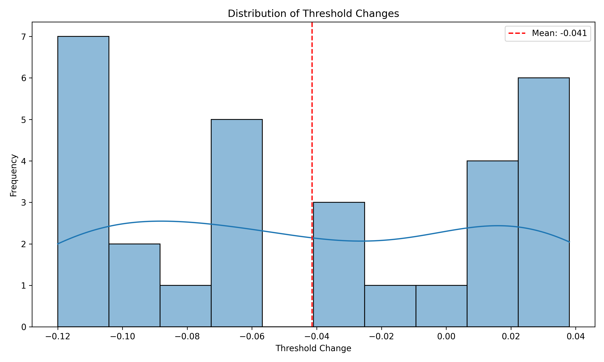

# AdaptiVision Experiment Report

## Overview

- Total images processed: 30
- Successfully processed: 30
- Failed: 0

## Key Findings

- Average scene complexity: 0.677
- Average threshold adjustment: -0.041
- Average objects detected (standard): 5.23
- Average objects detected (adaptive): 6.83
- Average processing time (standard): 0.0408s
- Average processing time (adaptive): 0.0309s
- Average speed improvement: 1.30x

## Visualizations

### Scene Complexity vs. Threshold Adaptation

### Object Detection Comparison

### Processing Time Comparison

### Speed Improvement Distribution

### Threshold Change Distribution

### Scene Complexity Distribution

### Impact of Scene Complexity on Detection

## Sample Comparisons

