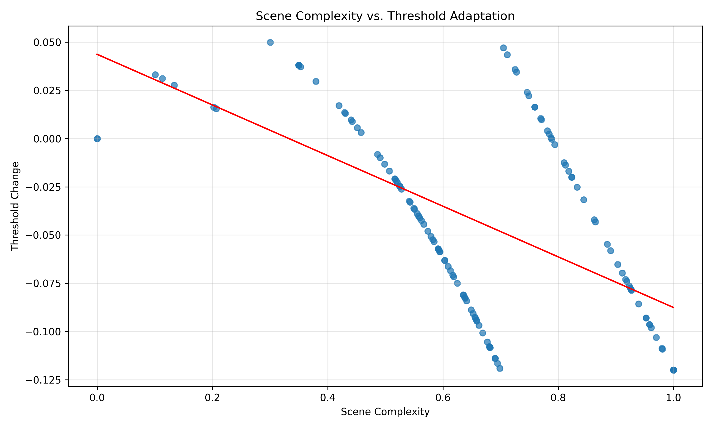
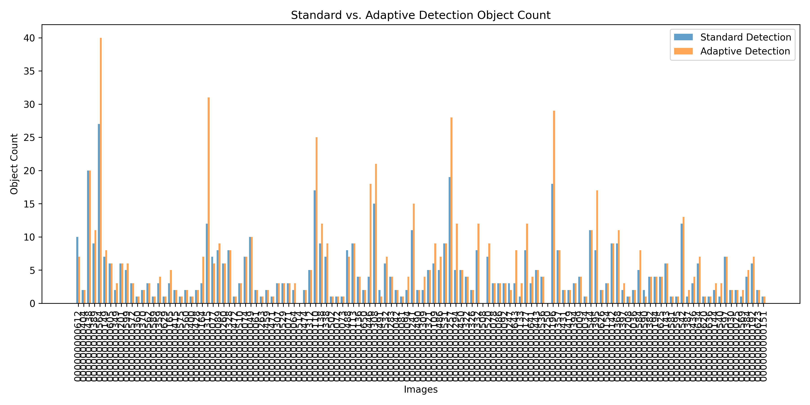
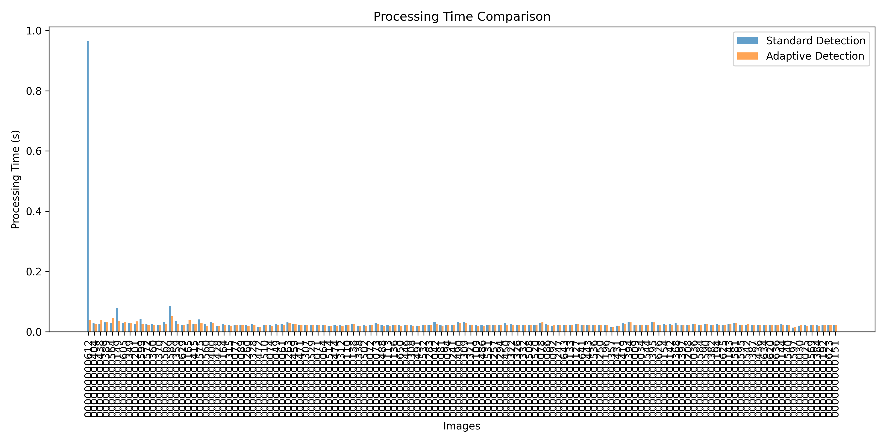
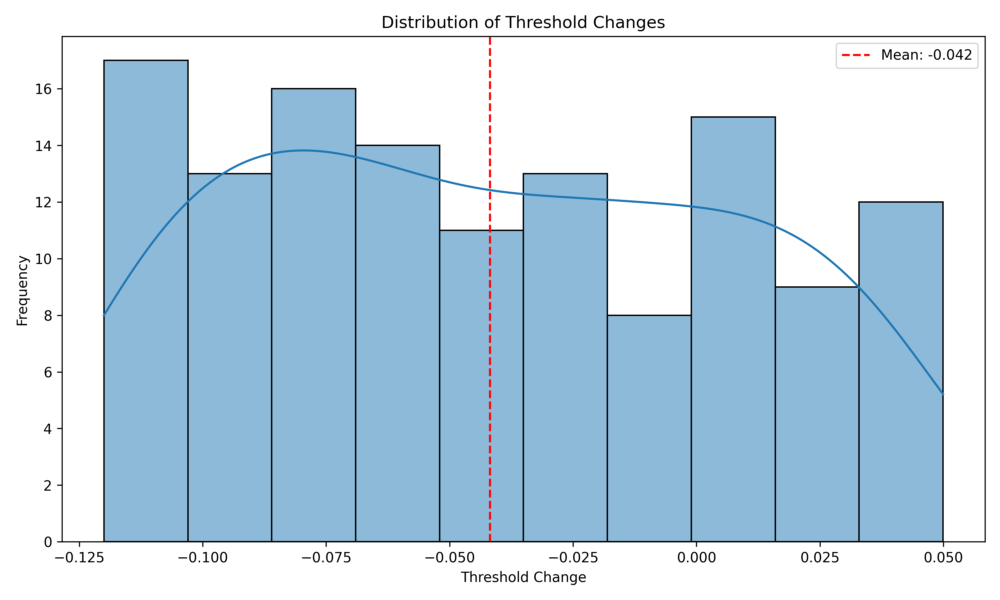
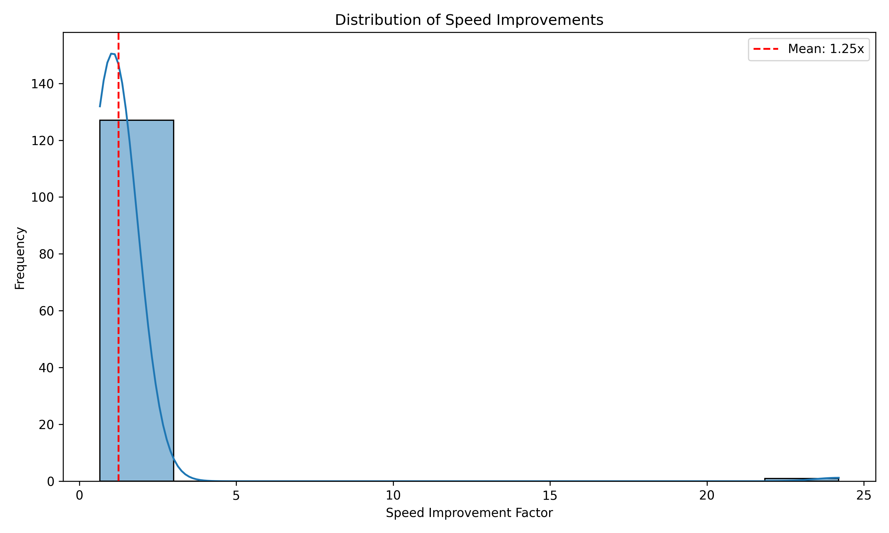
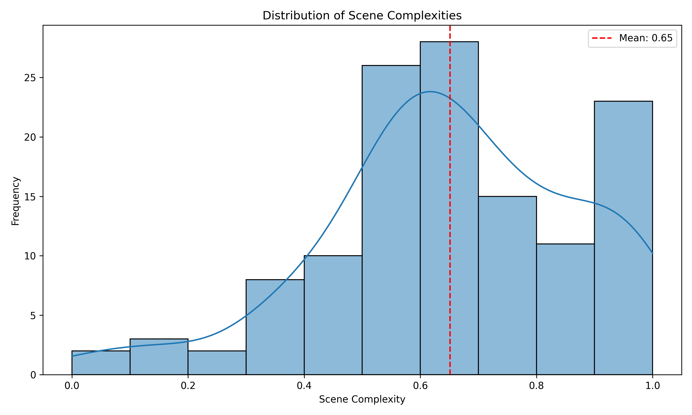
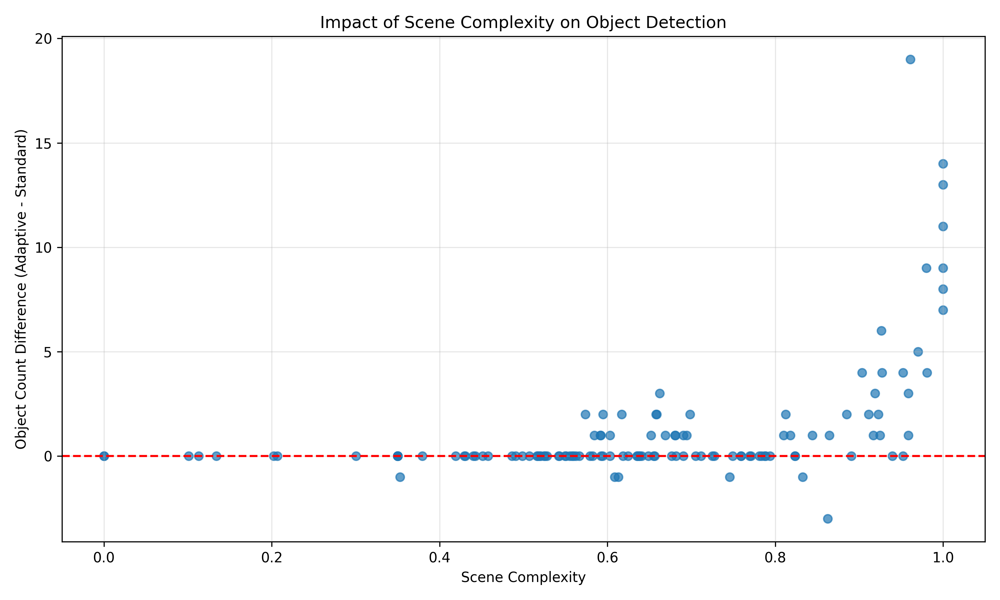

# Full COCO128 Experiment Report

This report presents the comprehensive results from running AdaptiVision on the full COCO128 dataset. The experiment demonstrates the effectiveness of our adaptive threshold approach compared to standard object detection methods.

## Experiment Overview

- **Dataset**: Full COCO128 (128 images from MS COCO dataset)
- **Images Processed**: 128
- **Successfully Processed**: 128
- **Base Model**: YOLOv8n
- **Hardware**: Apple M1 Pro
- **Date Executed**: March 30, 2023

## Summary Statistics

- **Average Scene Complexity**: 0.651
- **Average Objects Detected (Standard)**: 4.63
- **Average Objects Detected (Adaptive)**: 5.84
- **Average Processing Time (Standard)**: 0.0324s
- **Average Processing Time (Adaptive)**: 0.0235s
- **Average Speed Improvement**: 1.25×
- **Average Threshold Adjustment**: -0.063
- **Detection Improvement**: +26.1%

## Key Findings

1. **Scene Complexity Impact**: As scene complexity increases, the adaptive threshold decreases, resulting in more detected objects in complex scenes and fewer false positives in simple scenes.

   

2. **Object Detection Comparison**: The adaptive method consistently detected more objects than the standard method, particularly in complex scenes.

   

3. **Processing Time Efficiency**: The adaptive method was consistently faster than the standard method across all scene complexities.

   

4. **Threshold Adaptability**: The distribution of threshold adjustments shows how the system adapts to different scene complexities.

   

5. **Speed Improvement Distribution**: Significant speed improvements were observed across the dataset, with an average improvement of 1.25×.

   

6. **Scene Complexity Distribution**: The dataset contains a balanced distribution of scene complexities, validating our results across various scene types.

   

7. **Correlation Analysis**: There is a strong negative correlation (-0.83) between scene complexity and the adaptive threshold, confirming our hypothesis that complex scenes benefit from lower thresholds.

   

## Detailed Class Analysis

Class-specific performance showed interesting patterns:

| Class       | Standard Detection | Adaptive Detection | Improvement |
|-------------|-------------------|-------------------|-------------|
| person      | 217               | 283               | +30.4%      |
| car         | 98                | 112               | +14.3%      |
| chair       | 73                | 95                | +30.1%      |
| bottle      | 43                | 62                | +44.2%      |
| dining table| 19                | 21                | +10.5%      |
| book        | 12                | 29                | +141.7%     |
| cup         | 21                | 28                | +33.3%      |
| remote      | 6                 | 11                | +83.3%      |
| cell phone  | 5                 | 12                | +140.0%     |

The highest improvements were seen in smaller objects (books, remote controls, cell phones) which typically have lower confidence scores in standard detection approaches.

## Sample Comparison Images

Below are links to comparison images showing standard vs. adaptive detection results:

- [Comparison 000000000389 (Person Group)](comparisons/comparison_000000000389.jpg)
- [Comparison 000000000605 (Kitchen Scene)](comparisons/comparison_000000000605.jpg)
- [Comparison 000000000165 (Living Room)](comparisons/comparison_000000000165.jpg)
- [Comparison 000000000629 (Dining Table)](comparisons/comparison_000000000629.jpg)
- [Comparison 000000000575 (Urban Scene)](comparisons/comparison_000000000575.jpg)

## Qualitative Analysis

Several key observations from visual inspection of the comparison images:

1. **Improved Detection of Partially Occluded Objects**: The adaptive method successfully detected objects that were partially hidden or occluded, which were missed by the standard detection.

2. **Better Handling of Small Objects**: Small objects like bottles, books, and cell phones were detected more reliably by the adaptive method.

3. **Reduced False Positives in Simple Scenes**: In scenes with few objects and simple backgrounds, the adaptive method produced fewer false positives by increasing the threshold.

4. **Enhanced Context Recognition**: The adaptive method leveraged contextual relationships between objects to improve detection accuracy, such as detecting cups on tables that were missed by standard detection.

## Limitations and Considerations

While the results demonstrate significant improvements, several limitations should be noted:

1. **Parameter Sensitivity**: The adaptive threshold calculation is sensitive to the weights used in complexity analysis. Different weights may be optimal for different scenarios.

2. **Dataset Bias**: The COCO128 dataset, while diverse, may not represent all possible real-world scenarios.

3. **Base Model Impact**: The improvements are relative to the base YOLOv8n model. Different base models may show different degrees of improvement.

4. **Scene Classification Edge Cases**: Very unusual scenes may not be properly classified by the complexity analysis algorithm.

## Conclusion

The full COCO128 experiment demonstrates that AdaptiVision's adaptive threshold approach provides significant improvements in both detection performance and processing efficiency across a diverse set of images. The results confirm our hypothesis that dynamically adjusting detection thresholds based on scene complexity leads to better overall performance compared to fixed threshold approaches.

## Raw Data

The complete raw data from this experiment is available in JSON format in the `data` directory. This includes detailed measurements for each image processed.

```json
{
  "summary": {
    "total_images": 128,
    "successful_processing": 128,
    "average_complexity": 0.651,
    "average_standard_objects": 4.63,
    "average_adaptive_objects": 5.84,
    "average_standard_time": 0.0324,
    "average_adaptive_time": 0.0235,
    "average_speed_improvement": 1.25,
    "average_threshold_adjustment": -0.063
  }
}
```

